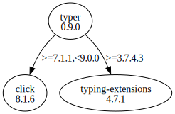

# Third Party Dependencies

<!--[[[fill sbom_sha256()]]]-->
The [SBOM in CycloneDX v1.4 JSON format](https://git.sr.ht/~sthagen/kysy/blob/default/etc/sbom/cdx.json) with SHA256 checksum ([f44e999c ...](https://git.sr.ht/~sthagen/kysy/blob/default/etc/sbom/cdx.json.sha256 "sha256:f44e999c7ebe7e3a30e537bb44e763968c06488ed087cb305533ccaa0a084d5a")).
<!--[[[end]]] (checksum: 59df3fd88831b8954e9e76052bb08fc3)-->
## Licenses 

JSON files with complete license info of: [direct dependencies](direct-dependency-licenses.json) | [all dependencies](all-dependency-licenses.json)

### Direct Dependencies

<!--[[[fill direct_dependencies_table()]]]-->
| Name                                       | Version                                        | License     | Author            | Description (from packaging data)                                  |
|:-------------------------------------------|:-----------------------------------------------|:------------|:------------------|:-------------------------------------------------------------------|
| [typer](https://github.com/tiangolo/typer) | [0.9.0](https://pypi.org/project/typer/0.9.0/) | MIT License | Sebastián Ramírez | Typer, build great CLIs. Easy to code. Based on Python type hints. |
<!--[[[end]]] (checksum: 80e791c1fdef7665f4104495541de7b1)-->

### Indirect Dependencies

<!--[[[fill indirect_dependencies_table()]]]-->
| Name                                          | Version                                        | License     | Author                                | Description (from packaging data)         |
|:----------------------------------------------|:-----------------------------------------------|:------------|:--------------------------------------|:------------------------------------------|
| [click](https://palletsprojects.com/p/click/) | [8.1.6](https://pypi.org/project/click/8.1.6/) | BSD License | Pallets <contact@palletsprojects.com> | Composable command line interface toolkit |
<!--[[[end]]] (checksum: 7b69d9be7fa227d2db394dcd865606d8)-->

## Dependency Tree(s)

JSON file with the complete package dependency tree info of: [the full dependency tree](package-dependency-tree.json)

### Rendered SVG

Base graphviz file in dot format: [Trees of the direct dependencies](package-dependency-tree.dot.txt)



### Console Representation

<!--[[[fill dependency_tree_console_text()]]]-->
````console
typer==0.9.0
├── click [required: >=7.1.1,<9.0.0, installed: 8.1.6]
└── typing-extensions [required: >=3.7.4.3, installed: 4.7.1]
````
<!--[[[end]]] (checksum: 87d0a3766895ebb1ed68148dc5374ad1)-->
